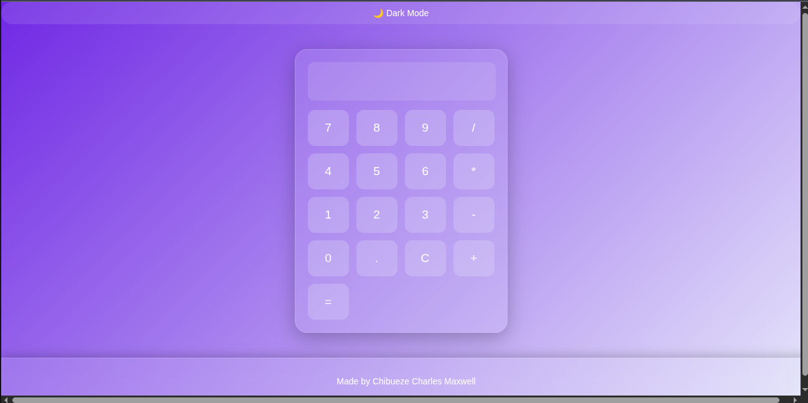

# [Calculator](https://github.com/maxchichar/Calculator)

A simple yet powerful web-based calculator built with **Go** (backend) and HTML/CSS/JavaScript (frontend). It supports complex mathematical expressions using the `govaluate` library.

<picture>
  <source media="(prefers-color-scheme: dark)" srcset="screenshots/screenshot-dark.png">
  <source media="(prefers-color-scheme: light)" srcset="screenshots/screenshot-light.png">
  
</picture>

## Features

- Evaluate complex math expressions (e.g. `2 + 3 * sin(π/2)`, `sqrt(16) + 5^2`, `2^10`, etc.)
- Clean and responsive user interface
- REST API backend (`/api/calc`)
- Graceful error handling (shows "mperi" for invalid expressions)
- Lightweight and fast — no heavy frameworks

## Tech Stack

- **Backend**: Go + [govaluate](https://github.com/Knetic/govaluate)
- **Frontend**: HTML, CSS, JavaScript (served statically)
- Minimal dependencies

## Quick Start

### Prerequisites
- Go 1.21+

### Run the Calculator

```bash
git clone https://github.com/maxchichar/Calculator.git
cd Calculator
go run main.go
```

Then open your browser and visit:http://localhost:8080

## Project Structure
```
Calculator/
├── main.go                 # Backend server and calculation logic
├── go.mod
├── go.sum
└── static/
    └── index.html          # Frontend (HTML + CSS + JS)
```

## API

### POST `/api/calc`
#### Body:
```json
{
  "expr": "3 * (4 + 5)"
}
```

#### Response:
```json
{
  "result": 27
}
```

---

## Contributing

Feel free to fork the project and submit pull requests. Issues and feature suggestions are welcome!

## License

MIT License

---

Made with ❤️ by [Chibueze Maxwell](https://github.com/maxchichar)

